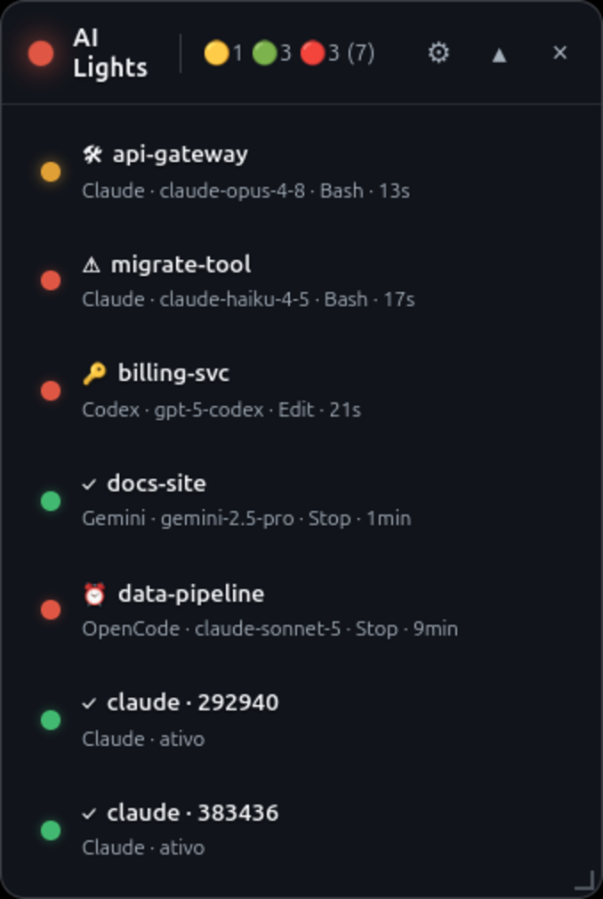

# 🚦 AI Traffic Lights

[English](README.md) | **Português (Brasil)**

Overlay translúcido sempre no topo (Electron) que mostra o estado de cada
sessão de **agente de IA em terminal** no seu desktop como um semáforo:
🟢 pronto · 🟡 trabalhando · 🔴 precisa de você.

Monitora **Claude Code** hoje. A arquitetura é agnóstica — Gemini CLI, Codex
e OpenCode entram via adapters (ver [Adicionando um agente](#adicionando-um-novo-agente)).



## Por quê

Rodando várias sessões de agentes em paralelo — terminais, abas, projetos —
você perde o fio: qual terminou, qual ainda processa, qual está há dez minutos
esperando uma aprovação em silêncio. O overlay resolve num relance: uma luz
por sessão, clique para pular pro terminal — **janela _e_ aba**.

## Funcionalidades

- 🟢🟡🔴 Uma luz por sessão + luz agregada no cabeçalho
- **Click-to-focus**: pula pro terminal da sessão — a janela exata e, no Warp,
  a **aba** exata (via `warp://session/<uuid>`)
- 🔔 Beep + notificação nativa quando uma sessão fica vermelha (rate-limited)
- ⏰ Escalada de idle: sessão pronta e esquecida por 5 min vira vermelha
- ✏️ Duplo-clique renomeia a sessão (apelidos persistem por projeto)
- Altura automática, arrasta por qualquer lugar, largura ajustável, posição persistida
- Ícone no tray (mostrar/ocultar, autostart, sair) + atalho global **`Ctrl+Alt+H`**
- Sai do caminho: fora da barra de janelas/alt-tab, nunca maximiza, sem scrollbar

## Requisitos

- **Linux**. X11: suporte completo (testado em GNOME/Mutter). **Wayland:
  parcial** — o overlay roda via XWayland; o foco de aba funciona no Warp
  (`focus_url`); o foco de janela alcança só terminais XWayland. Ver Solução
  de problemas.
- `wmctrl`, `xdotool`, `jq` — `sudo apt install wmctrl xdotool jq`
- Node.js 20+
- Um agente suportado: [Claude Code](https://claude.com/claude-code) hoje

## Instalação (do fonte)

```bash
git clone https://github.com/aronpc/ai-traffic-lights.git
cd ai-traffic-lights
npm install
npm run setup-hook   # registra o adapter do Claude Code no ~/.claude/settings.json
npm start            # abre o overlay
```

O `setup-hook` é idempotente e cirúrgico: faz backup do `settings.json` e
nunca toca hooks de outras ferramentas. O comando registrado aponta para uma
**cópia estável** auto-atualizada do hook em
`~/.local/share/ai-traffic-lights/bin/` — mover o projeto (ou rodar o
AppImage, cujo ponto de montagem muda a cada execução) nunca quebra nada.
`npm run remove-hook` desfaz tudo com o mesmo cuidado. O menu do tray oferece
as mesmas ações de instalar/remover para instalações empacotadas.

Sessões novas do Claude Code aparecem imediatamente; sessões já abertas
aparecem no próximo evento delas.

## Como funciona

```
Sessão Claude Code ──hooks──▶ traffic-hook.sh (adapter, <25ms, fork-free)
                                     │ escreve
                                     ▼
                   ~/.local/share/ai-traffic-lights/state/<sessão>.json
                                     │ observado (chokidar)
                                     ▼
                   Electron main ──IPC──▶ renderer: computeState() → 🟢🟡🔴
```

> **Decisão de arquitetura:** o adapter só registra eventos. O **estado (cor)
> é computado no renderer**, porque a escalada de idle (verde→vermelho após
> N min) exige relógio — coisa que um hook event-driven não tem.

> **O contrato de integração é o state file, não o código.** Qualquer coisa
> que escreva um JSON válido no diretório de estado vira uma luz no overlay.

### Contrato do state file (schema_version 2)

**Local:** `${XDG_DATA_HOME:-~/.local/share}/ai-traffic-lights/state/<session_id>.json`

```jsonc
{
  "schema_version": 2,           // bump ao mudar o schema
  "agent": "claude",             // id do agente (chave em src/agents.js)
  "session_id": "abc-123",       // chave, = nome do arquivo
  "pid": 986893,                 // PID do processo do agente (sweep de mortos)
  "cwd": "/home/user/projeto",   // diretório do projeto (basename = label padrão)
  "term_program": "WarpTerminal",// terminal de origem (null se desconhecido)
  "windowid": "67108868",        // janela X11 da sessão — ver abaixo
  "focus_url": "warp://session/8726…", // URI nativa de foco do terminal (Warp)
  "zellij_session": null,        // nome da sessão zellij, se dentro do zellij
  "last_event": "Stop",          // último hook_event_name
  "last_event_ts": 1783124001,   // epoch do último evento (UTC)
  "last_tool": "Bash",           // último tool_name (null em evento sem tool)
  "events": [                    // log rolante (últimos 50), append-only
    { "ts": 1783124000, "event": "PostToolUse", "tool": "Bash" },
    { "ts": 1783124001, "event": "Stop",        "tool": null }
  ]
}
```

**Tipos:** todo `*_ts` é epoch inteiro. `windowid` é **string** (decimal do
xdotool ou hex `0x…`; o app normaliza). `pid` é inteiro.

### Focando a janela certa — e a aba certa

- **`windowid`**: no `UserPromptSubmit`/`SessionStart`, a janela focada do
  desktop **é** o terminal da sessão (você acabou de digitar nela). O adapter
  fotografa `xdotool getactivewindow` nesse instante e preserva o valor entre
  eventos. Isso desambigua terminais single-process multi-janela (Warp, Tilix,
  GNOME Terminal) e zellij/tmux (cuja árvore de processos leva a um server
  daemonizado, não ao terminal visível).
- **`focus_url`**: abas não existem pro X11 — só o próprio terminal as
  alcança. O Warp exporta `WARP_FOCUS_URL=warp://session/<uuid>` em toda
  sessão; abrir a URI faz raise da janela **e** ativa a aba/pane exata.
  Terminais com mecanismos parecidos entram pela allowlist
  `FOCUS_URL_SCHEMES` (main.js).

O `focusSession()` compõe camadas: `windowid` exato → fallback por
ancestralidade de processos → `focus_url` para a aba.

### Mapeamento evento → estado (computeState, renderer)

| Evento do adapter | level | reason (sub-ícone) |
|---|---|---|
| `SessionStart` | done 🟢 | ✓ (inicial) |
| `UserPromptSubmit`, `PreToolUse`, `PostToolUse` | processing 🟡 | 🛠 |
| `Stop` | done 🟢 (→ awaiting 🔴⏰ se idle > 5 min) | ✓ / ⏰ |
| `PermissionRequest` | awaiting 🔴 | 🔑 |
| `Notification` | awaiting 🔴 **só se precisa de input** | ❓ |
| `PostToolUseFailure` | awaiting 🔴 | ⚠️ |

## Adicionando um novo agente

Dois passos — o app se adapta ao que você declarar:

1. **Registre-o** em [`src/agents.js`](src/agents.js): uma linha com `label`
   (UI) e `comm` (nomes de processo em `/proc/<pid>/comm`, para detectar
   sessões vivas que ainda não têm state file).
2. **Escreva um adapter**: qualquer coisa que grave state files seguindo o
   contrato acima. O adapter do Claude Code
   ([`hooks/traffic-hook.sh`](hooks/traffic-hook.sh)) é a implementação de
   referência.

Detalhes em [CONTRIBUTING.md](CONTRIBUTING.md).

## Solução de problemas

- **Overlay mostra "nenhuma sessão ativa"** — rodou `npm run setup-hook`?
  Sessões já abertas só aparecem no próximo evento (mande qualquer prompt).
- **Clique não foca / foca a janela errada** — `wmctrl` e `xdotool`
  instalados? No Wayland eles não funcionam (roadmap). O pulo pra aba exata
  só existe no Warp por enquanto.
- **Wayland** — o overlay em si roda bem (XWayland). Janelas Wayland nativas
  não podem ser focadas por terceiros, então o click-to-focus depende da URI
  de foco do terminal (Warp hoje); o atalho global pode não disparar com um
  app Wayland nativo em foco. Alternativas: clique no ícone do tray, ou
  vincule um atalho customizado do GNOME ao comando do app — **relançar
  alterna mostrar/ocultar** (instância única).
- **Onde ficam meus dados?** — `${XDG_DATA_HOME:-~/.local/share}/ai-traffic-lights/`
  (state files, posição da janela, apelidos). Pode apagar; regenera sozinho.
- **Debug do renderer** — `ATL_DEBUG=1 npm start` loga em `/tmp/atl-renderer.log`.

## Desenvolvimento

```bash
npm install
npm start
```

Testar o adapter isolado:

```bash
echo '{"session_id":"t","hook_event_name":"Stop","cwd":"/tmp"}' | bash hooks/traffic-hook.sh
cat "${XDG_DATA_HOME:-$HOME/.local/share}/ai-traffic-lights/state/t.json" | jq .
```

## Roadmap

- [ ] Adapters: Gemini CLI · Codex · OpenCode (entradas do registro prontas em
  `src/agents.js`; falta pesquisar os mecanismos de evento de cada um)
- [ ] Foco de janela Wayland nativo completo (hoje: XWayland + URI de foco do
  Warp + relançar-para-alternar)
- [ ] Empacotamento: AppImage + .deb (electron-builder)
- [ ] Threshold de idle e atalho configuráveis

## Licença

[MIT](LICENSE)
